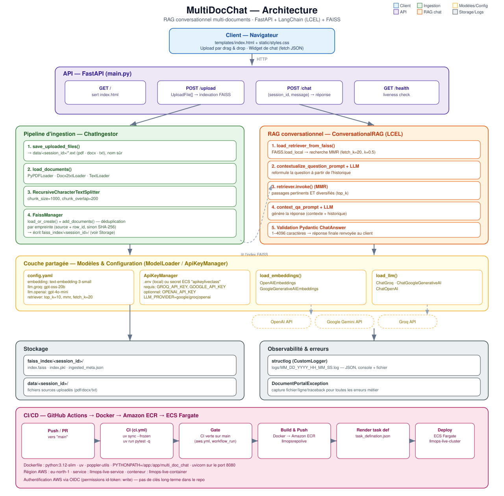

# MultiDocChat


**MultiDocChat** est une application de **RAG conversationnel multi-documents** : on téléverse un ou plusieurs fichiers (PDF, DOCX, TXT), l'application les indexe dans un vector store **FAISS**, puis on peut discuter avec le contenu via un chat qui garde l'historique de la conversation.

Le backend est en **FastAPI**, l'orchestration du RAG en **LangChain (LCEL)**, et le tout est packagé en **Docker** avec un pipeline **CI/CD GitHub Actions → Amazon ECR → ECS Fargate**.

## Sommaire

- [Aperçu](#aperçu)
- [Architecture](#architecture)
- [Stack technique](#stack-technique)
- [Structure du projet](#structure-du-projet)
- [Installation](#installation)
- [Configuration](#configuration)
- [Lancer le projet](#lancer-le-projet)
- [Utilisation de l'API](#utilisation-de-lapi)
- [Tests](#tests)
- [Évaluation du RAG](#évaluation-du-rag)
- [CI/CD & déploiement](#cicd--déploiement)
- [Journalisation & gestion des erreurs](#journalisation--gestion-des-erreurs)
- [Limitations connues](#limitations-connues)

## Aperçu

- **Upload multi-documents** par glisser-déposer (PDF / DOCX / TXT) via une petite interface web (`templates/index.html`).
- **Ingestion par session** : chaque upload crée un `session_id` unique, ses fichiers et son index FAISS sont isolés dans `data/<session_id>/` et `faiss_index/<session_id>/`.
- **Déduplication** des chunks déjà indexés (empreinte basée sur la source, sinon SHA‑256 du contenu) pour éviter de réingérer deux fois le même passage.
- **Chaîne RAG conversationnelle (LCEL)** en deux temps : reformulation de la question à partir de l'historique, puis génération de la réponse à partir des passages récupérés (recherche **MMR** pour diversifier les résultats).
- **Multi-fournisseurs** pour les embeddings (OpenAI, Google) et le LLM (Groq, Google Gemini, OpenAI), sélectionnables via `config.yaml` et une variable d'environnement.
- **Validation de sortie** avec un modèle Pydantic (`ChatAnswer`) avant de renvoyer la réponse au client.
- **Logs structurés** (structlog, JSON) et exceptions métier centralisées avec capture de la trace complète.

## Architecture



Deux flux principaux partagent la même couche « Modèles & Configuration » (`ModelLoader` / `ApiKeyManager`) :

1. **Ingestion** (`POST /upload`) : sauvegarde des fichiers → chargement (`PyPDFLoader` / `Docx2txtLoader` / `TextLoader`) → découpage (`RecursiveCharacterTextSplitter`, 1000/200) → indexation idempotente dans FAISS (`FaissManager`).
2. **Chat** (`POST /chat`) : chargement du retriever FAISS de la session → reformulation de la question avec l'historique → recherche MMR → génération de la réponse → validation Pydantic.

## Stack technique

| Domaine | Choix |
|---|---|
| API | FastAPI, Uvicorn, Jinja2 (page unique) |
| Orchestration RAG | LangChain (LCEL), `langchain-community`, `langchain-core` |
| LLM | Groq (`openai/gpt-oss-20b`), Google Gemini, OpenAI (`gpt-4o-mini`) — au choix |
| Embeddings | OpenAI (`text-embedding-3-small`) ou Google |
| Vector store | FAISS (`faiss-cpu`), persistance locale par session |
| Chargement documents | `PyPDFLoader`, `Docx2txtLoader`, `TextLoader` |
| Logging | `structlog` (JSON) + fichiers dans `logs/` |
| Config | YAML (`multi_doc_chat/config/config.yaml`) + `.env` |
| Tests | `pytest` (unitaires + intégration via `TestClient`) |
| Évaluation | Notebook `notebook/evaluations.ipynb`, jeu de questions/réponses `data/goldens.csv`, traçage LangSmith |
| Packaging | Docker (`python:3.12-slim`), gestion des dépendances avec `uv` |
| CI/CD | GitHub Actions → build/push Docker vers Amazon ECR → déploiement ECS Fargate |

## Structure du projet

```
LLMOPS/
├── main.py                        # Application FastAPI (routes /, /upload, /chat, /health)
├── docs/
│   └── architecture.svg           # Schéma d'architecture
├── multi_doc_chat/
│   ├── config/config.yaml         # Fournisseurs & paramètres (embeddings, LLM, retriever)
│   ├── model/models.py            # Modèles Pydantic (ChatAnswer, requêtes/réponses)
│   ├── prompts/prompt_library.py  # Prompts LCEL (reformulation + QA contextuelle)
│   ├── exception/custom_exception.py
│   ├── logger/cutom_logger.py     # Logger structlog (JSON)
│   ├── utils/
│   │   ├── model_loader.py        # ModelLoader + ApiKeyManager (multi-fournisseurs)
│   │   ├── config_loader.py       # Chargement robuste de config.yaml
│   │   ├── document_ops.py        # Chargement des documents par extension
│   │   └── file_io.py             # Sauvegarde sécurisée des fichiers uploadés
│   └── src/
│       ├── document_ingestion/data_ingestion.py  # ChatIngestor + FaissManager
│       └── document_chat/retrieval.py            # ConversationalRAG (chaîne LCEL)
├── templates/index.html           # Interface web (upload + chat)
├── static/styles.css
├── tests/                         # Tests unitaires et d'intégration (pytest)
├── notebook/                      # Prototypage RAG, ingestion, évaluations
├── data/                          # Fichiers sources par session (généré à l'exécution)
├── faiss_index/                   # Index FAISS par session (généré à l'exécution)
├── logs/                          # Logs applicatifs (générés à l'exécution)
├── Dockerfile
├── pyproject.toml / uv.lock / requirements.txt
└── .github/workflows/             # ci.yml (tests) + aws.yml (build & déploiement ECS)
```

## Installation

Prérequis : **Python 3.12+**, et pour l'ingestion PDF, `poppler-utils` sur la machine (déjà géré dans le `Dockerfile`).

Avec [`uv`](https://docs.astral.sh/uv/) (recommandé, cohérent avec `uv.lock`) :

```bash
uv sync
```

Ou avec `pip` :

```bash
python -m venv .venv
.venv\Scripts\activate
pip install -r requirements.txt
```

## Configuration

Créer un fichier `.env` à la racine (non versionné) avec au minimum :

```env
GROQ_API_KEY=...
GOOGLE_API_KEY=...
OPENAI_API_KEY=...
LLM_PROVIDER=groq
```

| Variable | Requise | Rôle |
|---|---|---|
| `GROQ_API_KEY` | oui | requise par `ApiKeyManager` (même si le LLM utilisé est un autre fournisseur) |
| `GOOGLE_API_KEY` | oui | requise par `ApiKeyManager` (idem) |
| `OPENAI_API_KEY` | selon config | nécessaire car `config.yaml` utilise **OpenAI par défaut pour les embeddings** (`text-embedding-3-small`) |
| `LLM_PROVIDER` | conseillé | sélectionne le bloc LLM dans `config.yaml` : `groq` ou `openai` |
| `LANGCHAIN_API_KEY`, `LANGCHAIN_ENDPOINT`, `LANGCHAIN_PROJECT` | non | traçage LangSmith optionnel, utile pour `notebook/evaluations.ipynb` |
| `ENV` | non | `production` désactive le chargement de `.env` (utilise les secrets d'environnement, ex. ECS) |

> ⚠️ **À vérifier avant de lancer en local** : `ModelLoader.load_llm()` lit `LLM_PROVIDER` avec `"google"` comme valeur par défaut, mais `multi_doc_chat/config/config.yaml` ne définit actuellement de bloc `llm` que pour `groq` et `openai` (pas `google`). Sans définir explicitement `LLM_PROVIDER=groq` ou `LLM_PROVIDER=openai`, le chargement du LLM échoue avec `LLM provider 'google' not found in config`.

Les formats effectivement **indexés** (`load_documents`) sont PDF, DOCX et TXT ; `file_io.py` accepte aussi PPTX/MD/CSV/XLSX/DB à l'upload mais ces extensions ne sont pas encore prises en charge par le chargeur de documents.

## Lancer le projet

**En local :**

```bash
uv run uvicorn main:app --reload --port 8000
```

Puis ouvrir [http://localhost:8000](http://localhost:8000).

**Avec Docker :**

```bash
docker build -t multidocchat .
docker run --env-file .env -p 8080:8080 multidocchat
```

L'application écoute sur le port `8080` dans le conteneur (`8000` en local via `python main.py`).

## Utilisation de l'API

Téléverser des documents et récupérer un `session_id` :

```bash
curl -F "files=@rapport.pdf" http://localhost:8000/upload
```

Poser une question sur la session indexée :

```bash
curl -X POST http://localhost:8000/chat \
  -H "Content-Type: application/json" \
  -d '{"session_id": "session_20260101_120000_abcd1234", "message": "Résume ce document."}'
```

`GET /health` renvoie `{"status": "ok"}` pour les *health checks* (utilisé par ECS).

## Tests

```bash
uv run pytest -q
```

Les tests (`tests/unit`, `tests/integration`) utilisent des doublures (`stub_model_loader`, `stub_ingestor`, `stub_rag` dans `tests/conftest.py`) pour éviter tout appel réseau réel vers les fournisseurs de LLM/embeddings.

## Évaluation du RAG

- `data/goldens.csv` : paires question/réponse de référence pour évaluer la qualité des réponses.
- `notebook/evaluations.ipynb` : évaluation du pipeline RAG avec traçage **LangSmith**.
- `notebook/RAG.ipynb`, `notebook/data_ingestion.ipynb`, `notebook/experiments.ipynb` : prototypage et expérimentation en amont de `multi_doc_chat/`.

## CI/CD & déploiement

- **`.github/workflows/ci.yml`** : à chaque push/PR sur `main`, installe les dépendances avec `uv sync --frozen` et exécute `pytest`.
- **`.github/workflows/aws.yml`** : déclenché quand `ci.yml` a réussi sur `main` (ou `DeployOnAWS`) ; construit l'image Docker, la pousse sur **Amazon ECR** (`llmopsrepolive`), met à jour la définition de tâche (`task_defination.json`) et déploie sur **ECS Fargate** (`llmops-live-cluster` / `llmops-live-service`, région `eu-north-1`).
- Authentification AWS via `aws-actions/configure-aws-credentials` (clés stockées en secrets GitHub) ; permissions `id-token: write` pour OIDC.

## Journalisation & gestion des erreurs

- `CustomLogger` (structlog) écrit des logs JSON en console et dans `logs/MM_DD_YYYY_HH_MM_SS.log` (un fichier par démarrage de processus).
- `DocumentPortalException` uniformise les erreurs métier : fichier, ligne et traceback complet sont capturés puis journalisés, tout en renvoyant un message clair côté API (`HTTPException` 500 avec détail).

## Limitations connues

- L'historique de conversation (`SESSIONS`) est **en mémoire process** : il est perdu au redémarrage de l'application et ne fonctionne pas s'il y a plusieurs workers/instances derrière un load balancer.
- Pas de suppression automatique des sessions : `data/<session_id>/` et `faiss_index/<session_id>/` s'accumulent avec le temps.

---